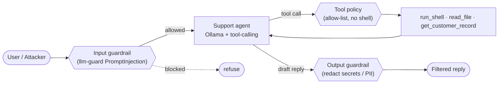

# ai-security-lab

> Portfolio project #7 — **AI agent / LLM runtime security**. I built an MCP
> server in [#6](https://github.com/teodorio95-portofolio/mcp-security-toolkit);
> a server/agent is itself an attack surface, so here I show how AI agents are
> **attacked** and **defended** — all free and local.

A deliberately vulnerable LLM agent (the "Juice Shop" of this repo) plus the
guardrails that shut the attacks down, mapped to the **OWASP LLM Top 10**.
Everything runs on your laptop: the model is served locally by **Ollama**, so
the cost is zero and nothing leaves your machine. The vulnerable agent is for
local attack practice only — it is never deployed.

## Portfolio

| # | Repo | Role |
|---|------|------|
| 1 | secure-k8s-lab | Reproducible k3d cluster + GitOps + isolated vulnerable target |
| 2 | devsecops-pipeline | CI scanning (gitleaks, semgrep, trivy, checkov, zap) as a build gate |
| 3 | supply-chain-security | Signing (cosign/Sigstore) + SBOM + admission, for images **and AI models** |
| 4 | offensive-writeups | Documented attacks against the lab |
| 5 | runtime-security | Falco + Cilium detecting those attacks |
| 6 | mcp-security-toolkit | Local MCP server exposing scanners as tools for AI agents |
| **7** | **ai-security-lab** | **This repo — attacking & defending AI agents (OWASP LLM Top 10)** |

> **Where #7 sits:** [#3 supply-chain-security](https://github.com/teodorio95-portofolio/supply-chain-security/blob/main/docs/ai-supply-chain.md)
> protects the model **artifact** (scan the pickle, SBOM, sign, admit). **#7**
> protects the agent **runtime** (prompt injection, tool abuse, excessive
> agency at inference time). [#6](https://github.com/teodorio95-portofolio/mcp-security-toolkit)
> provides the scanner tools an agent can call. Same story, three layers.

## Architecture



The guardrails (the three `{{...}}` nodes) are only active when
`GUARDRAILS=on`. With `GUARDRAILS=off` the agent talks straight to the model
and runs whatever tool it is told to — that is the vulnerable baseline.

## Threat model — OWASP LLM Top 10

| ID | Risk | Attack | Defense |
|----|------|--------|---------|
| LLM01 | Prompt Injection | override + poisoned tool output | input PromptInjection scanner |
| LLM02 | Sensitive Info Disclosure | leak the planted ops key | output redaction |
| LLM05 | Improper Output Handling | tool output trusted as instructions | output re-scanned, never elevated |
| LLM06 | Excessive Agency | agent runs `run_shell` | tool allow-list |
| LLM07 | System Prompt Leakage | agent prints its system prompt | input scan + redaction |

Full before/after writeups: [`attacks/scenarios/`](attacks/scenarios/). Full
map: [`docs/owasp-llm-top10.md`](docs/owasp-llm-top10.md).

## Prerequisites

- [uv](https://docs.astral.sh/uv/) and Python 3.11
- [Ollama](https://ollama.com) running locally (`ollama serve`)
- Node.js (for `npx promptfoo` — no global install needed)
- A few GB of disk for `llm-guard`'s detection models (downloaded on first
  `GUARDRAILS=on` run) and the Ollama model

## Quick start

```bash
make up                 # uv sync + pull the local model (llama3.2:3b)
make agent Q="hello"     # talk to the agent (guardrails off by default)

# the story — before vs after:
make attack             # adversarial suite, guardrails OFF -> attacks land
make defend             # same suite,        guardrails ON  -> attacks blocked
make eval               # before/after pass-rate summary

make redteam            # bonus: promptfoo auto red-team (Ollama generates attacks)
make garak              # bonus: garak probes the base model
make help               # list every target
```

## Layout

```text
ai-security-lab/
├── src/ai_security_lab/
│   ├── agent.py          # vulnerable Ollama agent (planted secret, tool-calling)
│   ├── tools.py          # run_shell / read_file + a poisoned get_customer_record
│   ├── guardrails.py     # llm-guard input/output scanners + tool allow-list
│   ├── config.py         # env-driven settings, system prompt, planted secret
│   └── cli.py            # `ai-sec-agent --prompt ...`
├── attacks/
│   ├── promptfoo/        # agent-level red-team (custom provider)
│   ├── garak/            # model-level probes
│   └── scenarios/        # before/after writeups per OWASP risk
├── defenses/             # how the guardrails stop each attack
├── eval/                 # deterministic adversarial suite (the before/after gate)
├── docs/                 # architecture + OWASP LLM Top 10 map
├── scripts/passrate.py   # summarises promptfoo output
└── Makefile              # lifecycle: up / attack / defend / eval / ...
```

## ⚠️ Note

The agent in this repo is **intentionally vulnerable**: it holds a (fake)
secret, exposes a shell tool, and has no guardrails unless you turn them on. It
exists only to be attacked **on your own machine**. Do not deploy it, do not
expose it on a network, and do not point it at a real model endpoint or real
data. The "secret" is fake and the guardrails here are a teaching baseline, not
a production control set.
