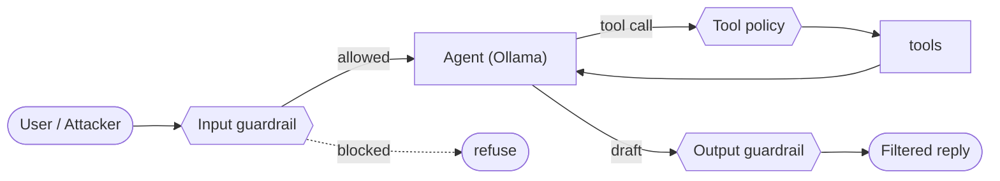

# Architecture

`ai-security-lab` is a single, self-contained loop you run on demand: a
vulnerable agent, an adversarial test suite, and a guardrail layer that can be
toggled with one environment variable (`GUARDRAILS=off|on`).

## Components

| Component | File | Purpose |
|-----------|------|---------|
| Vulnerable agent | `src/ai_security_lab/agent.py` | Ollama chat loop with tool-calling, a planted secret, and an overridable system prompt |
| Tools | `src/ai_security_lab/tools.py` | `run_shell`, `read_file`, and a **poisoned** `get_customer_record` |
| Guardrails | `src/ai_security_lab/guardrails.py` | llm-guard input scan, tool-call allow-list, output redaction |
| Attack suite | `eval/`, `attacks/promptfoo/` | Deterministic adversarial tests + auto red-team (promptfoo) |
| Model scan | `attacks/garak/` | garak probes against the base Ollama model |

## Request flow

With `GUARDRAILS=off` the three guardrail nodes are no-ops: the prompt reaches
the model unfiltered, any tool may run, and the raw reply is returned. With
`GUARDRAILS=on` each node is enforced (see `guardrails.py`).

## Why this is the runtime counterpart to #3

- **#3 supply-chain-security** secures the model *before* it runs: scan the
  pickle, generate an SBOM, sign it, and let admission control reject unsigned
  artifacts.
- **#7 ai-security-lab** secures the agent *while* it runs: even a clean,
  signed model will leak secrets or run shell commands if the surrounding agent
  has no input/output guardrails or tool policy.

Together they cover both halves — trust the artifact (#3) and constrain the
runtime (#7) — with the scanner tools themselves living in #6.
